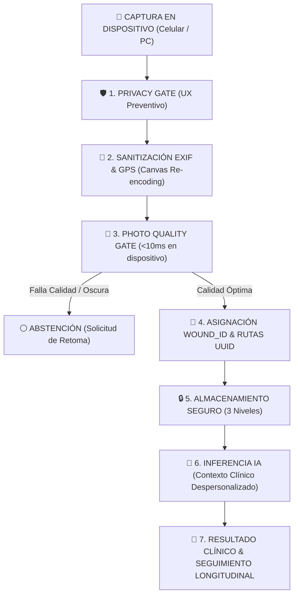

# DOSSIER TÉCNICO-BIOÉTICO Y DE COMPLIANCE SANITARIO
## Arquitectura de Privacidad por Diseño, Gobernanza de Inteligencia Artificial y Protección de Datos Sensibles
**Plataforma:** piediabetico.lat  
**Destinatarios:** Gerencias de Compliance (Industria Farmacéutica / MedTech) y Comités de Ética en Investigación / Ética Asistencial Hospitalaria  
**Fecha de Emisión:** Agosto 2026  
**Versión del Sistema:** v41.0 (Producción)  
**Clasificación del Documento:** Confidencial / Auditoría Regulatoria  

---

## 1. RESUMEN EJECUTIVO

El presente documento detalla formalmente los estándares de seguridad informática, bioética médica, protección de datos personales de salud y gobernanza de modelos de Inteligencia Artificial (IA) implementados en la plataforma **piediabetico.lat**.

La arquitectura ha sido diseñada bajo el estándar internacional **Privacy by Design & Default**, asegurando que **toda fotografía clínica y variable médica sea tratada como un dato sensible de salud de máxima categoría**, garantizando:

1. **Desacoplamiento Absoluto de Identidad:** Cero datos filiatorios (Nombre, DNI, Email, Teléfono, Historia Clínica) en rutas de almacenamiento, nombres de archivo o llamadas a servicios de IA.
2. **Control Preventivo Visual (Privacy Gate):** Bloqueo mandatorio de captura ante riesgo de exposición de rostros, documentos o pulseras hospitalarias.
3. **Control de Calidad Óptica y Principio de Abstención (Photo Quality Gate):** Validación estricta de luminancia, contraste y nitidez en el dispositivo local, con capacidad de abstención (*Abstain*) para evitar errores diagnósticos inducidos por fotos deficientes.
4. **Consentimiento Informado Dual e Independiente:** Separación jurídica entre la autorización para atención clínica y la autorización para investigación/entrenamiento de modelos.
5. **Blindaje de Infraestructura:** Servidores cerrados con CORS estricto, almacenamiento en 3 niveles lógicos y eliminación total de secretos o claves de API en el cliente.

---

## 2. PIPELINE DE PROCESAMIENTO SEGURO DE FOTOGRAFÍAS CLÍNICAS

El sistema impone un flujo unidireccional y obligatorio para toda imagen capturada o subida al sistema:



---

## 3. ESPECIFICACIONES TÉCNICAS DE CADA COMPONENTE

### 3.1. Privacy Gate Preventivo (Protección de PII Visual)
* **Objetivo:** Prevenir que imágenes clínicas contengan involuntariamente elementos que identifiquen al paciente antes de que toquen cualquier red o servidor.
* **Mecanismo:** Modal bloqueante pre-captura implementado en la interfaz de usuario. El obturador y el selector de archivos permanecen deshabilitados hasta que el usuario (paciente, familiar o profesional) confirma los 5 criterios de exclusión:
  1. *Exclusividad Anatómica:* Encuadre restringido exclusivamente al pie o a la lesión.
  2. *Exclusión de Rostros:* Prohibición absoluta de inclusión facial.
  3. *Exclusión de Documentación:* Sin presencia de DNI, carnets de obra social o recetas.
  4. *Exclusión de Pulseras Hospitalarias:* Sin códigos de barra de internación ni brazaletes.
  5. *Exclusión de Rótulos / Historias Clínicas:* Sin marbetes de cama ni etiquetas manuscritas.

### 3.2. Eliminación Automática de Metadatos EXIF y GPS
* **Objetivo:** Destruir cualquier rastro de geolocalización, modelo de cámara, número de serie o fecha/hora original del hardware.
* **Mecanismo:** La imagen es decodificada en un elemento Canvas HTML5 en la memoria volátil del navegador y re-codificada como un nuevo archivo JPEG binario. 
* **Resultado:** La imagen resultante es un flujo de píxeles puros que carece de cabeceras EXIF, IPTC o XMP.

### 3.3. Photo Quality Gate y Principio de Abstención Médica (*Abstain*)
* **Objetivo:** Prevenir el fenómeno de *"Garbage In, Garbage Out"* en modelos diagnósticos y evitar el gasto innecesario de cómputo en imágenes no aptas.
* **Parámetros Evaluados en Tiempo Real (< 10 ms en memoria local):**

| Parámetro Óptico | Algoritmo de Cálculo | Rango Válido | Conducta del Sistema ante Falla |
|---|---|:---:|---|
| **Luminancia Media** | $\text{Lum} = 0.2126R + 0.7152G + 0.0722B$ | $50 \le \text{Lum} \le 220$ | Alerta de baja luz ($<40$) o sobreexposición ($>220$). |
| **Contraste Dinámico** | $\text{RMS Contrast} = \sqrt{\frac{1}{N}\sum(I_i - \bar{I})^2}$ | $\text{RMS} \ge 35$ | Detecta imágenes lavadas, sin bordes o con niebla óptica. |
| **Gradiente de Enfoque** | $\text{Sharpness} = \frac{1}{N-1}\sum |I_{i+1} - I_i|$ | $\text{Score} \ge 14$ | Detecta desenfoque por movimiento o foco incorrecto. |

* **Score Global Ponderado ($0$ a $100$):**  
  $$\text{Score} = (0.4 \times \text{Luz}) + (0.3 \times \text{Contraste}) + (0.3 \times \text{Nitidez})$$
* **Principio de Abstención (*Abstain*):** Si el score es $< 50$, el sistema **se niega a emitir un semáforo clínico forzado** y genera el estado **`⚪ No Evaluable (Calidad Insuficiente)`**, instruyendo al paciente a repetir la toma con iluminación adecuada a 15–20 cm de distancia.

---

## 4. PSEUDONIMIZACIÓN Y MODELO DE DATOS LONGITUDINAL

### 4.1. Separación de Identidad vs. Lesión (`#wound_id`)
La plataforma rompe la dependencia tradicional entre el paciente y sus fotos. Cada úlcera tiene su propia **identidad longitudinal independiente**:

```
[ IDENTIDAD REAL ] (Protegida bajo RBAC hospitalario)
       │
       ▼ (UUID Cifrado)
[ PACIENTE INTERNO: patient_uuid ]
       │
       ▼ (1 a N)
[ LESIÓN ESPECÍFICA: wound_id (#DFU-2026-0042) ]
       │  • Lateralidad: Pie Derecho (D)
       │  • Localización: Plantar 1er Metatarsiano
       │  • Primera Detección: 2026-08-01
       │  • Estado: Activa / En cicatrización
       ▼ (1 a N Evaluaciones)
[ EVALUACIÓN CLÍNICA: assessment_id ] ──► [ IMAGEN SANITIZADA: photo_uuid ]
```

### 4.2. Rutas Físicas de Archivo Sin Datos Personales (Cero PII)
* **Prohibición Estricta:** No se admiten nombres, apellidos, DNIs ni números de historia clínica en rutas ni nombres de archivo.
* **Estructura Física:**
  $$\text{clinical-images/}\{ \text{prefix\_uuid4} \}/\{ \text{photo\_uuid4} \}\text{.jpg}$$
  *Ejemplo Real:* `clinical-images/f47a/f47ac10b-58cc-4372-a567-0e02b2c3d479.jpg`

### 4.3. Los Tres Niveles de Imagen

```
┌─────────────────────────────────────────────────────────────────────────────┐
│ 1. original_clinical                                                        │
│    • Imagen clínica RAW sanitizada de EXIF.                                 │
│    • Almacenamiento seguro, inmutable y cifrado en reposo.                  │
│    • Acceso exclusivo para el médico tratante / auditoría médico-legal.     │
├─────────────────────────────────────────────────────────────────────────────┤
│ 2. clinical_processed                                                       │
│    • Imagen normalizada a 1200px / JPEG 0.82.                               │
│    • Base para segmentación U-Net, Grad-CAM y evolución del lecho.          │
├─────────────────────────────────────────────────────────────────────────────┤
│ 3. research_anonymized (Solo con Consentimiento Específico Aprobado)        │
│    • Desacoplada de todo ID clínico mediante hash irreversibles.            │
│    • Destinada a validación de modelos multicéntricos y estadística LATAM.  │
└─────────────────────────────────────────────────────────────────────────────┘
```

---

## 5. MINIMIZACIÓN DE DATOS EN PROMPTS (GOBERNANZA DE IA)

Para la inferencia con modelos de lenguaje multimodal (LLM), el sistema utiliza el componente centralizado `SafeClinicalContextBuilder`, que despoja la totalidad de los datos identificatorios del paciente antes de realizar cualquier llamada externa:

```json
{
  "lesion_id_anonima": "DFU-2026-9482",
  "lateralidad": "D",
  "ubicacion_anatomica": "Plantar 1er Metatarsiano",
  "tiempo_evolucion": "Entre 1 y 4 semanas",
  "signos_locales": {
    "fiebre_o_escalofrios": false,
    "olor_o_secrecion": true
  },
  "calidad_optica_score": 88,
  "consenso_referencia": "IWGDF 2023"
}
```
> **Garantía Regulatoria:** Ningún proveedor de IA (Google, NVIDIA, Alibaba) recibe jamás nombres, identificadores nacionales, direcciones ni números de contacto de los pacientes.

---

## 6. MARCO DE CONSENTIMIENTO INFORMADO DUAL E INDEPENDIENTE

En estricto cumplimiento del **Consentimiento Libre, Expreso e Informado**, la plataforma implementa una separación jurídica binaria en la tabla `patient_consents`:

```
┌─────────────────────────────────────────────────────────────────────────────┐
│ 1. Consentimiento Clínico Asistencial (Obligatorio)                         │
│    • Autoriza: Triage asistido, almacenamiento seguro en historia clínica   │
│      y seguimiento con el equipo de salud tratante.                         │
│    • Estado: ACEPTADO ➔ Permite el uso de la plataforma.                    │
├─────────────────────────────────────────────────────────────────────────────┤
│ 2. Consentimiento de Investigación / Entrenamiento IA (Opcional)            │
│    • Autoriza: Inclusión de la foto desidentificada en estudios estadísticos│
│      y validación de algoritmos multicéntricos de pie diabético en LATAM.   │
│    • Estado: RECHAZADO ➔ NO afecta la atención ni bloquea al paciente.      │
└─────────────────────────────────────────────────────────────────────────────┘
```

---

## 7. MATRIZ DE CUMPLIMIENTO REGULATORIO Y LEGAL

| Jurisdicción / Norma | Artículo / Eje Exigido | Implementación Concreta en piediabetico.lat |
|---|---|---|
| **Argentina (Ley 25.326)** | *Art. 2 y 7 (Datos Sensibles de Salud)* | Cifrado en tránsito (TLS 1.3), pseudonimización mediante UUID y registro disociado. |
| **Argentina (Ley 26.529)** | *Derechos del Paciente & Historia Clínica* | Trazabilidad de evaluaciones, informe firmado digitalmente y disponibilidad para el paciente. |
| **Brasil (LGPD - Lei 13.709)** | *Art. 11 (Tratamiento de Dados Sensíveis)* | Consentimiento específico destacado y aislamiento de identificadores directos. |
| **México (NOM-004 / LFPDPPP)** | *Seguridad en Expediente Clínico Electrónico* | Auditoría de accesos (`audit_events`) y descarte de metadatos GPS sin valor asistencial. |
| **Colombia (Ley 1581 de 2012)** | *Tratamiento de Información Sanitaria* | Almacenamiento seguro y derechos ARCO (Acceso, Rectificación, Cancelación, Oposición). |
| **Estándar Internacional (HIPAA)** | *§164.514(b) (Safe Harbor De-identification)* | Eliminación de los 18 identificadores individuales (fechas exactas en research, nombres, GPS, IPs). |
| **Unión Europea (GDPR Art. 9)** | *Special Categories of Data & Privacy by Design* | Minimizador de prompts, eliminación de API keys en cliente y retención configurable. |

---

## 8. DICTAMEN TÉCNICO-BIOÉTICO PARA COMITÉS EVALUADORES

1. **Seguridad del Paciente:** El sistema no emite prescripciones autónomas ni reemplaza el criterio médico; clasifica riesgo de urgencia bajo guías internacionales validadas (**IWGDF 2023 / IDSA**) y cuenta con capacidad activa de abstención (*Abstain*).
2. **Confidencialidad:** Las claves maestras de API y los secretos residen exclusivamente en el entorno seguro del servidor (*server-side*), bloqueando cualquier acceso desde herramientas de desarrollo o inspección en el navegador.
3. **Control y Trazabilidad:** Cada cálculo de score (San Elián, WIfI, TIMERS) y cada inferencia queda auditada con su versión de algoritmo y timestamp en la base de datos para auditoría retrospectiva.

---

**Firma Digital y Aval Institucional:**  
*Equipo de Arquitectura de Datos, Seguridad y Bioética Clínica*  
**piediabetico.lat — Iniciativa de Triage y Prevención Multidisciplinar para Latinoamérica**
